# Создание собственных типов функциональных блоков

В этом руководстве вы узнаете, как создать собственный функциональный блок (ФБ). В этом документе представлено руководство для третьей версии 4diac. Во второй версии все шаги примеро такие же, но немного другой интерфейс.
Существует несколько различных типов функциональных блоков: мы покажем, как создать базовый, простой, составной и сервисный интерфейсный ФБ.
Новые ФБ станут доступны в палитре ФБ для использования в приложениях системы.

В документе будет рассмотрено создание:
- SimpleBlocks
- BasicBlocks
- CompositeBlocks
- InterfaceBlocks
- SubAppBlocks

Создайте новый функциональный блок, выбрав: File -> New -> Other...
После этого видим окно в котором надо выбрать какой вид файла мы будем создавать. Выбираем "Type".
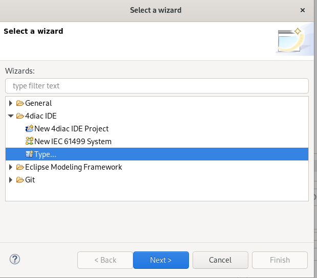

## Simple Block
### Создание блока в IDE
1. Первым делом создадим Simple Block, они имеют только один алгоритм и не используют ECC(про ECC чуть позже).

2. После выбора типа блока появится графическое представление блока по стандарту IEC61499. Слева можно выбрать входы и выходы которые вам нужны и просто перетащить на блок.
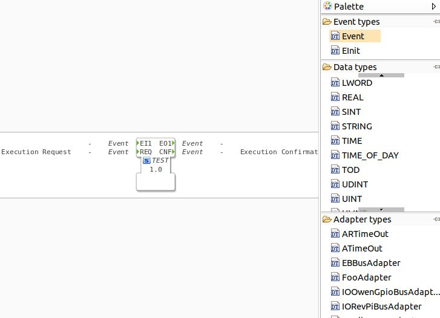

3. Также входы и выходы можно добавить снизу во вкладке Propirties. По умолчанию на блок уже добавлены событийные вход REQ и выход CNF. Оставляем их и добавляем входы для переменных нажимая на плюс. 
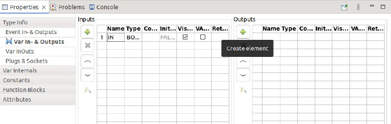

4. Входы и выходы переменных можно привязать к событиям, просто графически соединив их курсором.
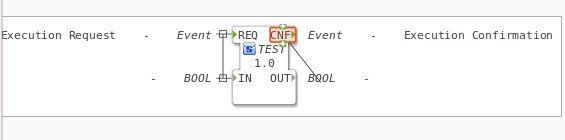

5. Далее перейдем во вкладку "Algorithm" добавим простой код для логического отрицания. Вы можете написать любой собственный алгорим на языке ST (Structured Text). 
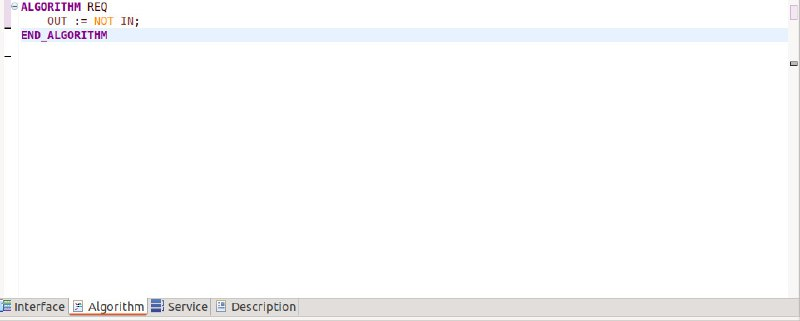

### Экспорт блока для forte
1. Нажимаем сверху File->Export. 

2. Выбираем из предложенных вариантов "4diac IDE Type Export"
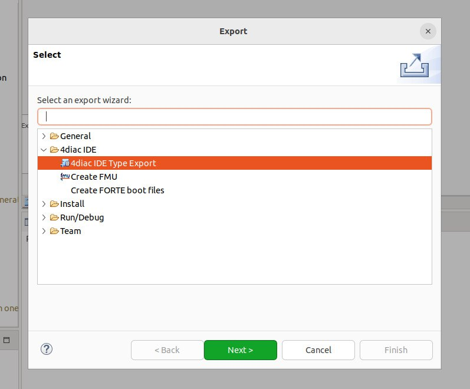

3. выбираем все блоки, которые хотим экспортировать, директорию для экспорта и опцию "Exportet". Также если вы создаете новую библиотеку блоков, можно автоматически сгенерировать для нее CMakeLists.txt
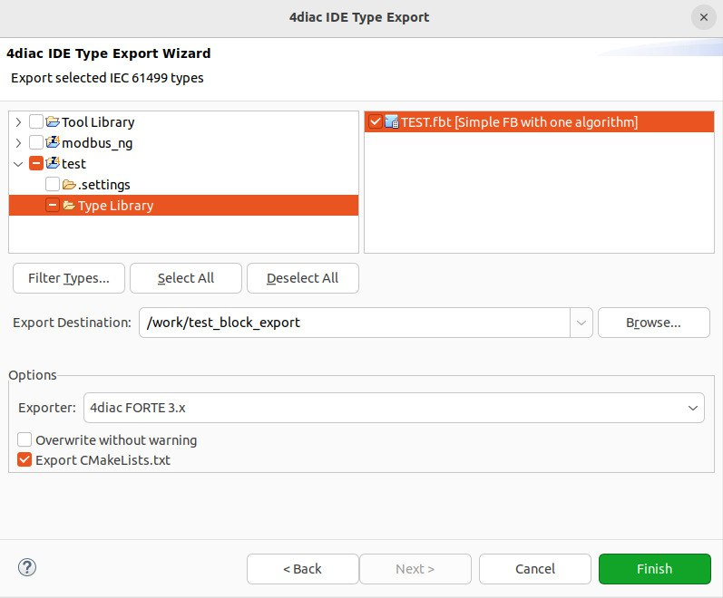

4. В выбраной ранее директории можем увидеть исполняемый файл и заголовочный. В файле с расширением .cpp в конце можем увидеть описанный нами ранее алгоритм на ST переведенный в код на C++.
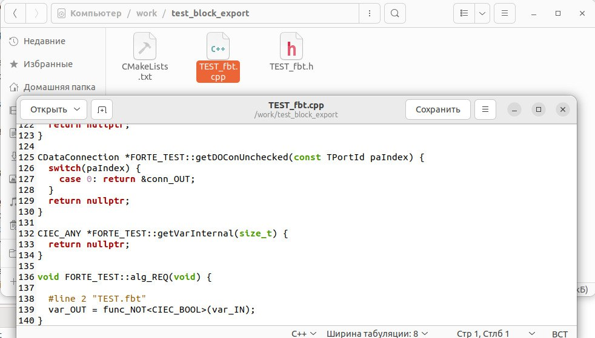

## Basic Block
1. После выбора File -> New -> Other -> Type выбираем Basic

2. Получаем функциональный блок и настраиваем входы и выходы как и в SimpleFB (показано ниже на рисунке).
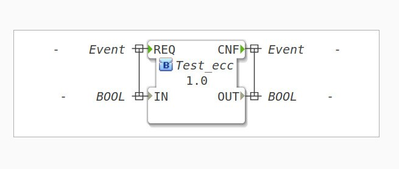

3. Заходим во вкладку с алгоритмом и добавляем логическое отрицание в качестве тестового алгоритма
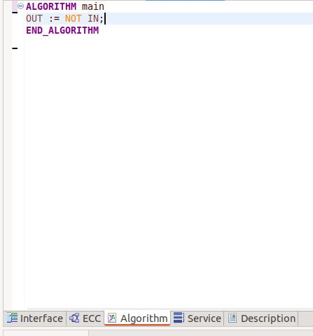

4. Далее во вкладке ECC можем графически настроить алгорим работы блока. 
- добавляем State и даем ему название
- добавляем Action. слева указываем название, написанного ранее алгоритма, а справа событийный выход для этого алгоритма.
- Cоединяем Start и добавленый ранее State выбирая нужный событийный вход
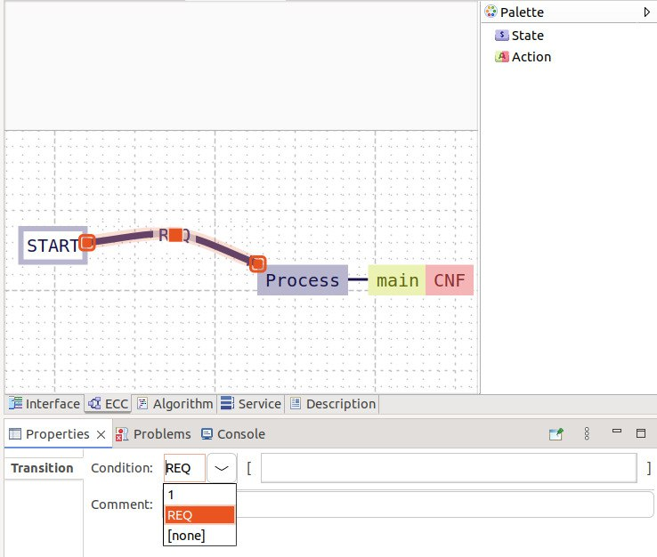

5. Далее можем экспортировать новый блок как в примере с Simple FB и увидим конвертированный алгоритм с ST на C++ в файле .cpp
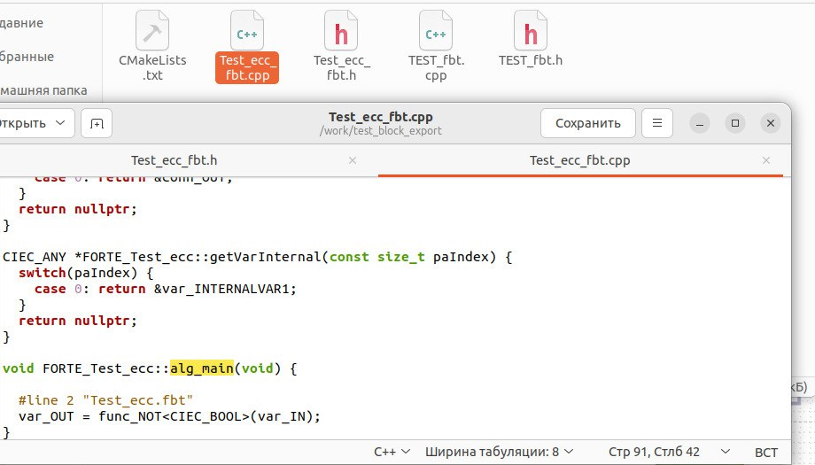

## Subapps
Subapp используется для того чтобы объединить несколько функиональных блоков в один.

1. После выбора File -> New -> Other -> Type выбираем Subapp

2. Настраиваем необходимые для нас входы и выходы во вкладке Interface -> Properties
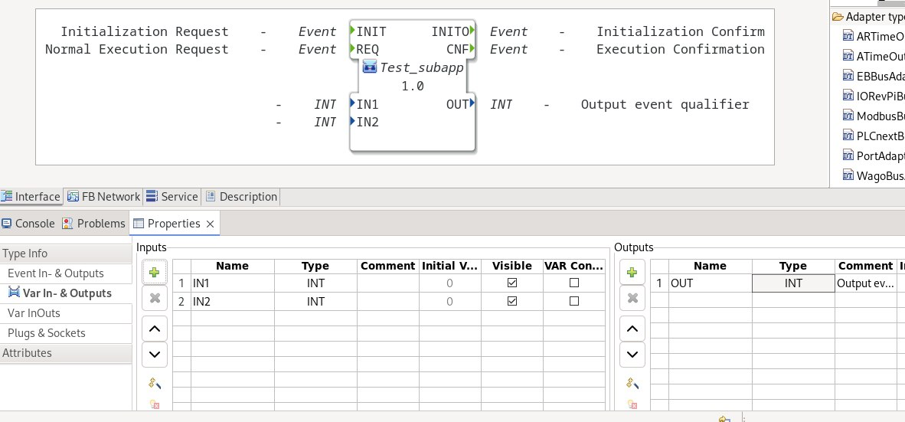

3. Добавляем необходимые для нас функцианальные блоки и настраиваем все необходимые связи между блоками.
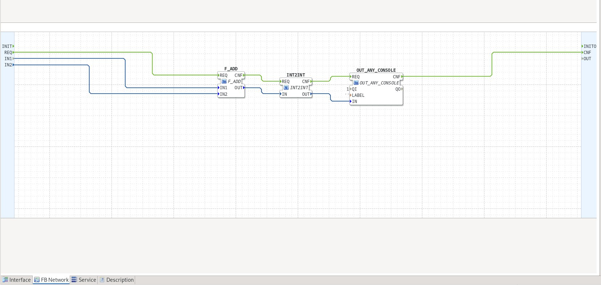

4. Экспортировать Subapp не надо можно использовать сразу после выполнения всего вышеописанного. Необходимо только чтобы все использованные функциональные блоки были скомпилированы в forte.
